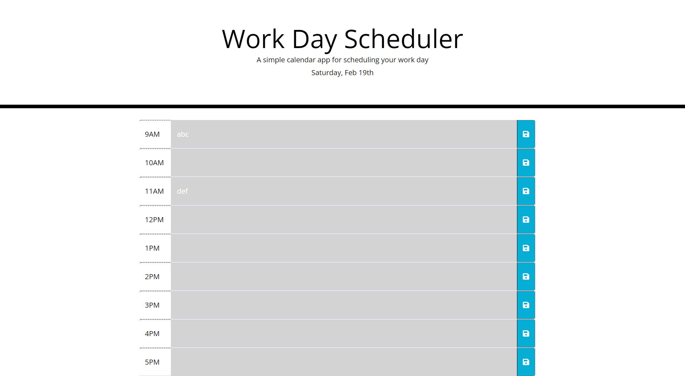

# Homework5_Calendar
This code is for a simple work calendar. Jquery is used capture inputs and post them to local storage. Local storage is rendered on page load. Momentjs is used to set the current date and color code the time blocks. 

Screenshot of finished work can be seen below:

The website is deployed here:
 https://bhodge166.github.io/Homework5_Calendar/